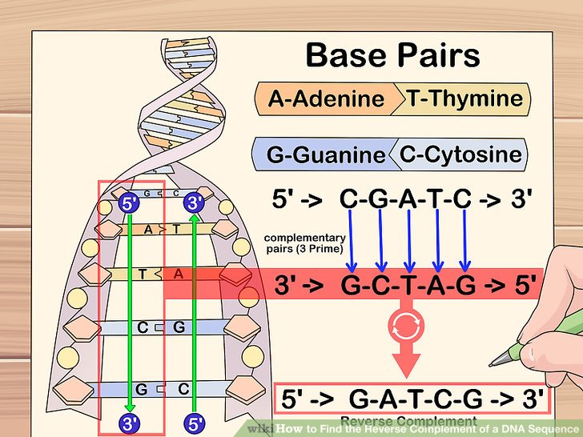
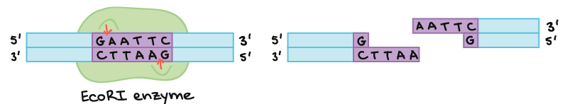

Python 3 Problem Set -- Strings
===================
1. What data types are considered sequences in Python?
2. What is the length of the following DNA string? Is this DNA string a Python sequence?
```
GATGGGATTGGGGTTTTCCCCTCCCATGTGCTCAAGACTGGCGCTAAAAGTTTTGAGCTTCTCAAAAGTCTAGAGCCACCGTCCAGGGAGCAGGTAGCTGCTGGGCTCCGGGGACACTTTGCGTTCGGGCTGGGAGCGTGCTTTCCACGACGGTGACACGCTTCCCTGGATTGGCAGCCAGACTGCCTTCCGGGTCACTGCCATGGAGGAGCCGCAGTCAGATCCTAGCGTCGAGCCCCCTCTGAGTCAGGAAACATTTTCAGACCTATGGAAACTACTTCCTGAAAACAACGTTCTGTCCCCCTTGCCGTCCCAAGCAATGGATGATTTGATGCTGTCCCCGGACGATATTGAACAATGGTTCACTGAAGACCCAGGTCCAGATGAAGCTCCCAGAATTCGCCAGAGGCTGCTCCCCCCGTGGCCCCTGCACCAGCAGCTCCTACACCGGCGGCCCCTGCACCAGCCCCCTCCTGGCCCCTGTCATCTTCTGTCCCTTCCCAGAAAACCTACCAGGGCAGCTACGGTTTCCGTCTGGGCTTCTTGCATTCTGGGACAGCCAAGTCTGTGACTTGCACGTACTCCCCTGCCCTCAACAAGATGTTTTGCCAACTGGCCAAGACCTGCCCTGTGCAGCTGTGGGTTGATTCCACACCCCCGCCCGGCACCCGCGTCCGCGCCATGGCCATCTACAAGCAGTCACAGCACATGACGGAGGTTGTGAGGCGCTGCCCCCACCATGAGCGCTGCTCAGATAGCGATGGTCTGGCCCCTCCTCAGCATCTTATCCGAGTGGAAGGAAATTTGCGTGTGGAGTATTTGGATGACAGAAACACTTTTCG
```


3. In the **interpreter**:
	- Create a variable named 'DNA' which contains the sequence above.
	- Count the number of A's  
	- Count the number of T's  
	- Count the number of G's
	- Count the number of C's

4. In the **interpreter**:
    - Create a variable named 'bird' with the contents 'chicken'
    - Convert the contents of 'bird' to be uppercase and print
    - **Exit the interpreter**
  
5. Remember that from here on out as you write scripts make sure to commit your work along the way. You can wait until the end to push them to your remote repo, or you can do it now. It is probably smart to commit after each problem set question.
   
6. Write out the steps, in prose, that you will do to count the number of A's, T's, C's, and G's regardless of case. These can become comments. Start with:  
   \# create a variable that stores a string that represents a DNA sequence.  
   \# do something about the case of the nucleotide characters  
   \# count A's  
   \# fill in the rest of the steps
   
7. Continue writing your **script with a text editor** that counts the number of A's, T's, C's, and G's regardless of case:  
   a. Create a _positive control_, a short string with a known composition of nucleotides, for example, 'ATTGGGCCCC' A=1, T=2, G=3, C=4.  
   b. Test your script by running with the _positive control_.  
   c. Run with this sequence of unknown composition:  
```
GATGGGATTggggttttccccTCCCATGTGCTCAAGACTGGCGCTaaaaGttttGAGCTTCTCaaaaGTCTAGAGCCACCGTCCAGGGAGCAGGTAGCTGCTGGGCTCCggggACACTTTGCGTTCGGGCTGGGAGCGTGCTTTCCACGACGGTGACACGCTTCCCTGGATTGGCAGCCAGACTGCCTTCCGGGTCACTGCCATGGAGGAGCCGCAGTCAGATCCTAGCGTCGAGccccCTCTGAGTCAGGAAACAttttCAGACCTATGGAAACTACTTCCTGaaaaCAACGTTCTGTccccCTTGCCGTCCCAAGCAATGGATGATTTGATGCTGTccccGGACGATATTGAACAATGGTTCACTGAAGACCCAGGTCCAGATGAAGCTCCCAGAATTCGCCAGAGGCTGCTccccCCGTGGccccTGCACCAGCAGCTCCTACACCGGCGGccccTGCACCAGccccCTCCTGGccccTGTCATCTTCTGTCCCTTCCCAGaaaaCCTACCAGGGCAGCTACGGTTTCCGTCTGGGCTTCTTGCATTCTGGGACAGCCAAGTCTGTGACTTGCACGTACTccccTGCCCTCAACAAGATGttttGCCAACTGGCCAAGACCTGCCCTGTGCAGCTGTGGGTTGATTCCACAccccCGCCCGGCACCCGCGTCCGCGCCATGGCCATCTACAAGCAGTCACAGCACATGACGGAGGTTGTGAGGCGCTGccccCACCATGAGCGCTGCTCAGATAGCGATGGTCTGGccccTCCTCAGCATCTTATCCGAGTGGAAGGAAATTTGCGTGTGGAGTATTTGGATGACAGAAACACttttCG
```
The above sequence has these counts, check your output: 
 |nt|count|
 |--|--|
 |T|187|  
 |G|218|  
 |A|167|  
 |C|270|  

7. __Representing DNA as RNA__

Canonically, when double-stranded DNA is transcribed into a single stranded RNA molecule, the resulting mRNA sequence is equivalant to coding DNA nucleotides from the forward strand with the T's changed to U's. 
 


  Write a script to find and replace all instances of 'T' with 'U' in this DNA sequence. Begin with thinking and writing down your steps.
  - Start with this small test sequence (i.e., positive control): `ATGCATGC`
  - The test should return `AUGCAUGC`

  - Now run your code with this DNA sequence:
```
GATGGGATTGGGGTTTTCCCCTCCCATGTGCTCAAGACTGGCGCTAAAAGTTTTGAGCTTCTCAAAAGTCTAGAGCCACCGTCCAGGGAGCAGGTAGCTGCTGGGCTCCGGGGACACTTTGCGTTCGGGCTGGGAGCGTGCTTTCCACGACGGTGACACGCTTCCCTGGATTGGCAGCCAGACTGCCTTCCGGGTCACTGCCATGGAGGAGCCGCAGTCAGATCCTAGCGTCGAGCCCCCTCTGAGTCAGGAAACATTTTCAGACCTATGGAAACTACTTCCTGAAAACAACGTTCTGTCCCCCTTGCCGTCCCAAGCAATGGATGATTTGATGCTGTCCCCGGACGATATTGAACAATGGTTCACTGAAGACCCAGGTCCAGATGAAGCTCCCAGAATTCGCCAGAGGCTGCTCCCCCCGTGGCCCCTGCACCAGCAGCTCCTACACCGGCGGCCCCTGCACCAGCCCCCTCCTGGCCCCTGTCATCTTCTGTCCCTTCCCAGAAAACCTACCAGGGCAGCTACGGTTTCCGTCTGGGCTTCTTGCATTCTGGGACAGCCAAGTCTGTGACTTGCACGTACTCCCCTGCCCTCAACAAGATGTTTTGCCAACTGGCCAAGACCTGCCCTGTGCAGCTGTGGGTTGATTCCACACCCCCGCCCGGCACCCGCGTCCGCGCCATGGCCATCTACAAGCAGTCACAGCACATGACGGAGGTTGTGAGGCGCTGCCCCCACCATGAGCGCTGCTCAGATAGCGATGGTCTGGCCCCTCCTCAGCATCTTATCCGAGTGGAAGGAAATTTGCGTGTGGAGTATTTGGATGACAGAAACACTTTTCG
```
the result should be:
```text
GAUGGGAUUGGGGUUUUCCCCUCCCAUGUGCUCAAGACUGGCGCUAAAAGUUUUGAGCUUCUCAAAAGUCUAGAGCCACCGUCCAGGGAGCAGGUAGCUGCUGGGCUCCGGGGACACUUUGCGUUCGGGCUGGGAGCGUGCUUUCCACGACGGUGACACGCUUCCCUGGAUUGGCAGCCAGACUGCCUUCCGGGUCACUGCCAUGGAGGAGCCGCAGUCAGAUCCUAGCGUCGAGCCCCCUCUGAGUCAGGAAACAUUUUCAGACCUAUGGAAACUACUUCCUGAAAACAACGUUCUGUCCCCCUUGCCGUCCCAAGCAAUGGAUGAUUUGAUGCUGUCCCCGGACGAUAUUGAACAAUGGUUCACUGAAGACCCAGGUCCAGAUGAAGCUCCCAGAAUUCGCCAGAGGCUGCUCCCCCCGUGGCCCCUGCACCAGCAGCUCCUACACCGGCGGCCCCUGCACCAGCCCCCUCCUGGCCCCUGUCAUCUUCUGUCCCUUCCCAGAAAACCUACCAGGGCAGCUACGGUUUCCGUCUGGGCUUCUUGCAUUCUGGGACAGCCAAGUCUGUGACUUGCACGUACUCCCCUGCCCUCAACAAGAUGUUUUGCCAACUGGCCAAGACCUGCCCUGUGCAGCUGUGGGUUGAUUCCACACCCCCGCCCGGCACCCGCGUCCGCGCCAUGGCCAUCUACAAGCAGUCACAGCACAUGACGGAGGUUGUGAGGCGCUGCCCCCACCAUGAGCGCUGCUCAGAUAGCGAUGGUCUGGCCCCUCCUCAGCAUCUUAUCCGAGUGGAAGGAAAUUUGCGUGUGGAGUAUUUGGAUGACAGAAACACUUUUCG
```

    
8. Find and replace all instances of 'T' with 'U' in this DNA sequence. **Notice that there are both uppercase and lowercase characters**. Start with a small test sequence that contains both upper and lower cased characters ('AtGcaTgC'). Confirm that you are generating the correct resulting sequence ('AUGCAUGC'). Begin with thinking and writing down your steps.
```
GATGGGATTggggttttccccTCCCATGTGCTCAAGACTGGCGCTaaaaGttttGAGCTTCTCaaaaGTCTAGAGCCACCGTCCAGGGAGCAGGTAGCTGCTGGGCTCCggggACACTTTGCGTTCGGGCTGGGAGCGTGCTTTCCACGACGGTGACACGCTTCCCTGGATTGGCAGCCAGACTGCCTTCCGGGTCACTGCCATGGAGGAGCCGCAGTCAGATCCTAGCGTCGAGccccCTCTGAGTCAGGAAACAttttCAGACCTATGGAAACTACTTCCTGaaaaCAACGTTCTGTccccCTTGCCGTCCCAAGCAATGGATGATTTGATGCTGTccccGGACGATATTGAACAATGGTTCACTGAAGACCCAGGTCCAGATGAAGCTCCCAGAATTCGCCAGAGGCTGCTccccCCGTGGccccTGCACCAGCAGCTCCTACACCGGCGGccccTGCACCAGccccCTCCTGGccccTGTCATCTTCTGTCCCTTCCCAGaaaaCCTACCAGGGCAGCTACGGTTTCCGTCTGGGCTTCTTGCATTCTGGGACAGCCAAGTCTGTGACTTGCACGTACTccccTGCCCTCAACAAGATGttttGCCAACTGGCCAAGACCTGCCCTGTGCAGCTGTGGGTTGATTCCACAccccCGCCCGGCACCCGCGTCCGCGCCATGGCCATCTACAAGCAGTCACAGCACATGACGGAGGTTGTGAGGCGCTGccccCACCATGAGCGCT
```
the result should be:
```text
GAUGGGAUUGGGGUUUUCCCCUCCCAUGUGCUCAAGACUGGCGCUAAAAGUUUUGAGCUUCUCAAAAGUCUAGAGCCACCGUCCAGGGAGCAGGUAGCUGCUGGGCUCCGGGGACACUUUGCGUUCGGGCUGGGAGCGUGCUUUCCACGACGGUGACACGCUUCCCUGGAUUGGCAGCCAGACUGCCUUCCGGGUCACUGCCAUGGAGGAGCCGCAGUCAGAUCCUAGCGUCGAGCCCCCUCUGAGUCAGGAAACAUUUUCAGACCUAUGGAAACUACUUCCUGAAAACAACGUUCUGUCCCCCUUGCCGUCCCAAGCAAUGGAUGAUUUGAUGCUGUCCCCGGACGAUAUUGAACAAUGGUUCACUGAAGACCCAGGUCCAGAUGAAGCUCCCAGAAUUCGCCAGAGGCUGCUCCCCCCGUGGCCCCUGCACCAGCAGCUCCUACACCGGCGGCCCCUGCACCAGCCCCCUCCUGGCCCCUGUCAUCUUCUGUCCCUUCCCAGAAAACCUACCAGGGCAGCUACGGUUUCCGUCUGGGCUUCUUGCAUUCUGGGACAGCCAAGUCUGUGACUUGCACGUACUCCCCUGCCCUCAACAAGAUGUUUUGCCAACUGGCCAAGACCUGCCCUGUGCAGCUGUGGGUUGAUUCCACACCCCCGCCCGGCACCCGCGUCCGCGCCAUGGCCAUCUACAAGCAGUCACAGCACAUGACGGAGGUUGUGAGGCGCUGCCCCCACCAUGAGCGCU
```

9. **Calculating GC content of DNA**: GC content is the **proportion** of bases that are either G or C.  GC content can be informative for many reasons. One is that the genomes of different organisms do not have the same GC content.  Read more at [WikiPedia](https://en.wikipedia.org/wiki/GC-content). Coding and non-coding regions within an organism have different GC content as well. 


    
In a script write out your steps as comments to calculates the GC content in the DNA string below. Fill in with code.

>It is ALWAYS a good idea to test your code with test data.  
>For example, the below sequence is long and you don't know for sure how many Gs and Cs are present.  
>Test your code with a DNA string that you KNOW the correct answer.  
>In 'AATTGGCCA' you know you have 2 Gs and 2 Cs.  
>Add code to calculate the AT content in addition to the GC content.  

```
GATGGGATTGGGGTTTTCCCCTCCCATGTGCTCAAGACTGGCGCTAAAAGTTTTGAGCTTCTCAAAAGTCTAGAGCCACCGTCCAGGGAGCAGGTAGCTGCTGGGCTCCGGGGACACTTTGCGTTCGGGCTGGGAGCGTGCTTTCCACGACGGTGACACGCTTCCCTGGATTGGCAGCCAGACTGCCTTCCGGGTCACTGCCATGGAGGAGCCGCAGTCAGATCCTAGCGTCGAGCCCCCTCTGAGTCAGGAAACATTTTCAGACCTATGGAAACTACTTCCTGAAAACAACGTTCTGTCCCCCTTGCCGTCCCAAGCAATGGATGATTTGATGCTGTCCCCGGACGATATTGAACAATGGTTCACTGAAGACCCAGGTCCAGATGAAGCTCCCAGAATTCGCCAGAGGCTGCTCCCCCCGTGGCCCCTGCACCAGCAGCTCCTACACCGGCGGCCCCTGCACCAGCCCCCTCCTGGCCCCTGTCATCTTCTGTCCCTTCCCAGAAAACCTACCAGGGCAGCTACGGTTTCCGTCTGGGCTTCTTGCATTCTGGGACAGCCAAGTCTGTGACTTGCACGTACTCCCCTGCCCTCAACAAGATGTTTTGCCAACTGGCCAAGACCTGCCCTGTGCAGCTGTGGGTTGATTCCACACCCCCGCCCGGCACCCGCGTCCGCGCCATGGCCATCTACAAGCAGTCACAGCACATGACGGAGGTTGTGAGGCGCTGCCCCCACCATGAGCGCTGCTCAGATAGCGATGGTCTGGCCCCTCCTCAGCATCTTATCCGAGTGGAAGGAAATTTGCGTGTGGAGTATTTGGATGACAGAAACACTTTTCG
```

Verify your code is correctly reporting AT and GC content:  

The above sequence has these counts: 
 |nt|count|
 |--|--|
 |T|187|  
 |G|218|  
 |A|167|  
 |C|270|  

 | content type | % |
 |--|--|
 | AT content | 42% |
 | GC content | 58% |
 
10. Extract and print the substring from nucleotide position 100 (not the same as its index) to nucleotide position 200 in this DNA sequence. Start with a small test sequence to make sure you are getting the correct output. 
```
GATGGGATTGGGGTTTTCCCCTCCCATGTGCTCAAGACTGGCGCTAAAAGTTTTGAGCTTCTCAAAAGTCTAGAGCCACCGTCCAGGGAGCAGGTAGCTGCTGGGCTCCGGGGACACTTTGCGTTCGGGCTGGGAGCGTGCTTTCCACGACGGTGACACGCTTCCCTGGATTGGCAGCCAGACTGCCTTCCGGGTCACTGCCATGGAGGAGCCGCAGTCAGATCCTAGCGTCGAGCCCCCTCTGAGTCAGGAAACATTTTCAGACCTATGGAAACTACTTCCTGAAAACAACGTTCTGTCCCCCTTGCCGTCCCAAGCAATGGATGATTTGATGCTGTCCCCGGACGATATTGAACAATGGTTCACTGAAGACCCAGGTCCAGATGAAGCTCCCAGAATTCGCCAGAGGCTGCTCCCCCCGTGGCCCCTGCACCAGCAGCTCCTACACCGGCGGCCCCTGCACCAGCCCCCTCCTGGCCCCTGTCATCTTCTGTCCCTTCCCAGAAAACCTACCAGGGCAGCTACGGTTTCCGTCTGGGCTTCTTGCATTCTGGGACAGCCAAGTCTGTGACTTGCACGTACTCCCCTGCCCTCAACAAGATGTTTTGCCAACTGGCCAAGACCTGCCCTGTGCAGCTGTGGGTTGATTCCACACCCCCGCCCGGCACCCGCGTCCGCGCCATGGCCATCTACAAGCAGTCACAGCACATGACGGAGGTTGTGAGGCGCTGCCCCCACCATGAGCGCTGCTCAGATAGCGATGGTCTGGCCCCTCCTCAGCATCTTATCCGAGTGGAAGGAAATTTGCGTGTGGAGTATTTGGATGACAGAAACACTTTTCG
```
The resulting sub-sequence should be: 
```text
GCTGGGCTCCGGGGACACTTTGCGTTCGGGCTGGGAGCGTGCTTTCCACGACGGTGACACGCTTCCCTGGATTGGCAGCCAGACTGCCTTCCGGGTCACTG
```
Test other sequence inputs and the resulting subsequences with the [Sequence Manipulation Site](https://www.bioinformatics.org/sms2/range_extract_dna.html?)  


12. Now use this DNA sequence in a case insensitive way to calculate the GC content in your substring (from 100 to 200, like above). Write out your steps then the code.
```
GATGGGATTggggttttccccTCCCATGTGCTCAAGACTGGCGCTaaaaGttttGAGCTTCTCaaaaGTCTAGAGCCACCGTCCAGGGAGCAGGTAGCTGCTGGGCTCCggggACACTTTGCGTTCGGGCTGGGAGCGTGCTTTCCACGACGGTGACACGCTTCCCTGGATTGGCAGCCAGACTGCCTTCCGGGTCACTGCCATGGAGGAGCCGCAGTCAGATCCTAGCGTCGAGccccCTCTGAGTCAGGAAACAttttCAGACCTATGGAAACTACTTCCTGaaaaCAACGTTCTGTccccCTTGCCGTCCCAAGCAATGGATGATTTGATGCTGTccccGGACGATATTGAACAATGGTTCACTGAAGACCCAGGTCCAGATGAAGCTCCCAGAATTCGCCAGAGGCTGCTccccCCGTGGccccTGCACCAGCAGCTCCTACACCGGCGGccccTGCACCAGccccCTCCTGGccccTGTCATCTTCTGTCCCTTCCCAGaaaaCCTACCAGGGCAGCTACGGTTTCCGTCTGGGCTTCTTGCATTCTGGGACAGCCAAGTCTGTGACTTGCACGTACTccccTGCCCTCAACAAGATGttttGCCAACTGGCCAAGACCTGCCCTGTGCAGCTGTGGGTTGATTCCACAccccCGCCCGGCACCCGCGTCCGCGCCATGGCCATCTACAAGCAGTCACAGCACATGACGGAGGTTGTGAGGCGCTGccccCACCATGAGCGCT
```
The GC content for the correct subsequence is 65%

13. Reverse Complements: 

___
Reverse Complement Overview
___
A sequence and its reverse complement represent the two strands of double stranded DNA or RNA. To calculate the reverse complement of DNA the nucleotides need to be translated into the complementary nucleotide, A -> T, T->A, G->C, and C->G, and the entire sequence needs to be reversed.  



To read more about reverse complements and to test your output see [Qiagen's page on reverse complements](https://www.qiagen.com/us/applications/enzymes/tools-and-calculators/reverse-complement-converter)
 
> ```
>  Original Sequence  5'ATGCAGGGGAAACATGATTCAGGAC 3'  
>  Complement         3'TACGTCCCCTTTGTACTAAGTCCTG 5'    
>  Reverse Complement 5'GTCCTGAATCATGTTTCCCCTGCAT 3'    
> ```
___  

You will be writing a script to generate and print the reverse complement of a nucleotide sequence. Write out the steps you will take in prose. These can become comments. Start with    
  
   \# create a variable that stores a string that represents a DNA sequence.  
   \# fill in the rest of the steps.    

Now fill in the code under your comments to write a script to generate and print the reverse complements of a DNA sequence. [Hint for reverse](http://bfy.tw/EXap). Use string formatting for printing.  

Use this sequence:
```text
GATGGGATTggggttttccccTCCCATGTGCTCAAGACTGGCGCTaaaaGttttGAGCTTCTCaaaaGTCTAGAGCCACCGTCCAGGGAGCAGGTAGCTGCTGGGCTCCggggACACTTTGCGTTCGGGCTGGGAGCGTGCTTTCCACGACGGTGACACGCTTCCCTGGATTGGCAGCCAGACTGCCTTCCGGGTCACTGCCATGGAGGAGCCGCAGTCAGATCCTAGCGTCGAGccccCTCTGAGTCAGGAAACAttttCAGACCTATGGAAACTACTTCCTGaaaaCAACGTTCTGTccccCTTGCCGTCCCAAGCAATGGATGATTTGATGCTGTccccGGACGATATTGAACAATGGTTCACTGAAGACCCAGGTCCAGATGAAGCTCCCAGAATTCGCCAGAGGCTGCTccccCCGTGGccccTGCACCAGCAGCTCCTACACCGGCGGccccTGCACCAGccccCTCCTGGccccTGTCATCTTCTGTCCCTTCCCAGaaaaCCTACCAGGGCAGCTACGGTTTCCGTCTGGGCTTCTTGCATTCTGGGACAGCCAAGTCTGTGACTTGCACGTACTccccTGCCCTCAACAAGATGttttGCCAACTGGCCAAGACCTGCCCTGTGCAGCTGTGGGTTGATTCCACAccccCGCCCGGCACCCGCGTCCGCGCCATGGCCATCTACAAGCAGTCACAGCACATGACGGAGGTTGTGAGGCGCTGccccCACCATGAGCGCT
```

The resulting reverse complement sequence should be:
```text
AGCGCTCATGGTGGGGGCAGCGCCTCACAACCTCCGTCATGTGCTGTGACTGCTTGTAGATGGCCATGGCGCGGACGCGGGTGCCGGGCGGGGGTGTGGAATCAACCCACAGCTGCACAGGGCAGGTCTTGGCCAGTTGGCAAAACATCTTGTTGAGGGCAGGGGAGTACGTGCAAGTCACAGACTTGGCTGTCCCAGAATGCAAGAAGCCCAGACGGAAACCGTAGCTGCCCTGGTAGGTTTTCTGGGAAGGGACAGAAGATGACAGGGGCCAGGAGGGGGCTGGTGCAGGGGCCGCCGGTGTAGGAGCTGCTGGTGCAGGGGCCACGGGGGGAGCAGCCTCTGGCGAATTCTGGGAGCTTCATCTGGACCTGGGTCTTCAGTGAACCATTGTTCAATATCGTCCGGGGACAGCATCAAATCATCCATTGCTTGGGACGGCAAGGGGGACAGAACGTTGTTTTCAGGAAGTAGTTTCCATAGGTCTGAAAATGTTTCCTGACTCAGAGGGGGCTCGACGCTAGGATCTGACTGCGGCTCCTCCATGGCAGTGACCCGGAAGGCAGTCTGGCTGCCAATCCAGGGAAGCGTGTCACCGTCGTGGAAAGCACGCTCCCAGCCCGAACGCAAAGTGTCCCCGGAGCCCAGCAGCTACCTGCTCCCTGGACGGTGGCTCTAGACTTTTGAGAAGCTCAAAACTTTTAGCGCCAGTCTTGAGCACATGGGAGGGGAAAACCCCAATCCCATC
```
Now, do this again, but maintain the original text capitalization. 


14. EcoRI is a restriction enzyme that cuts a specific paladromic double stranded DNA sequence, `GAATTC`, on both strands between the G and the A, resulting in single-stranded staggered overhangs:
   
    

     Write a script to find the starting nucleotide position of an [EcoRI](https://www.neb.com/products/r0101-ecori#Product%20Information) `GAATTC` site in the forward strand of the below DNA sequence. Remember DNA sequences start with a 1 and a python string starts with an index of 0. Run with test data first.

```
GATGGGATTGGGGTTTTCCCCTCCCATGTGCTCAAGACTGGCGCTAAAAGTTTTGAGCTTCTCAAAAGTCTAGAGCCACCGTCCAGGGAGCAGGTAGCTGCTGGGCTCCGGGGACACTTTGCGTTCGGGCTGGGAGCGTGCTTTCCACGACGGTGACACGCTTCCCTGGATTGGCAGCCAGACTGCCTTCCGGGTCACTGCCATGGAGGAGCCGCAGTCAGATCCTAGCGTCGAGCCCCCTCTGAGTCAGGAAACATTTTCAGACCTATGGAAACTACTTCCTGAAAACAACGTTCTGTCCCCCTTGCCGTCCCAAGCAATGGATGATTTGATGCTGTCCCCGGACGATATTGAACAATGGTTCACTGAAGACCCAGGTCCAGATGAAGCTCCCAGAATTCGCCAGAGGCTGCTCCCCCCGTGGCCCCTGCACCAGCAGCTCCTACACCGGCGGCCCCTGCACCAGCCCCCTCCTGGCCCCTGTCATCTTCTGTCCCTTCCCAGAAAACCTACCAGGGCAGCTACGGTTTCCGTCTGGGCTTCTTGCATTCTGGGACAGCCAAGTCTGTGACTTGCACGTACTCCCCTGCCCTCAACAAGATGTTTTGCCAACTGGCCAAGACCTGCCCTGTGCAGCTGTGGGTTGATTCCACACCCCCGCCCGGCACCCGCGTCCGCGCCATGGCCATCTACAAGCAGTCACAGCACATGACGGAGGTTGTGAGGCGCTGCCCCCACCATGAGCGCTGCTCAGATAGCGATGGTCTGGCCCCTCCTCAGCATCTTATCCGAGTGGAAGGAAATTTGCGTGTGGAGTATTTGGATGACAGAAACACTTTTCG
```  

- Also find the ending nucleotide position of the EcoRI site?
- Use [f"" string formatting](../pfb.md#string-formatting) to print out these two values like this:  
 
```
EcoRI startPos:yourStartPos endPos:yourEndPos
```

With the above sequence you should get:
```text
startPos:396 endPos:402
```


15. ADD/COMMIT/PUSH
